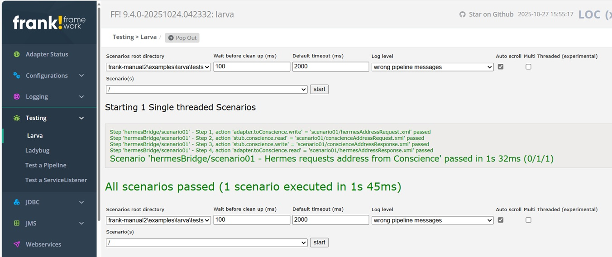

# Larva

The Frank!Framework provides two different tools for testing. This page explains Larva which is intended to unit-test Frank adapters.

### Stubbing

Larva tests expect that external systems are *stubbed*. To do this, set property `stub4testtool.configuration` to `true`. When this property is set, the Frank!Framework applies an XSLT transformation to the Frank configuration(s) to which this property applies. This transformed Frank configuration is not saved, but when the configuration is run then the transformed version is taken.

The exact XSLT transformation can be found in the source code of the Frank!Framework, filename `stub4testtool.xsl`. Advanced Frank developers can include their own `stub4testtool.xsl` in their project to override the default. The file should appear in the Java classpath with path `xml/xsl/stub4testtool.xsl`.

The default `stub4testtool.xsl` replaces senders that access external systems by instances of `IbisJavaSender`. The service name of the new sender is `testtool-<pipe name>`. It also adds a receiver to each adapter that has a JavaListener with serviceName `testtool-<adapter name>`. For details, please check out the source code of the Frank!Framework and visit 
`stub4testtool.xsl`. The file documents details of the transformation that is done.

### Writing Larva tests

An example project is in directory [examples/larva](../../examples/larva/). The configuration to be tested is [examples/larva/configurations/hermesBridge/ConfigurationToConscience.xml](../../examples/larva/configurations/hermesBridge/ConfigurationToConscience.xml). It has one adapter named `adapterToConscience`. In the adapter is a `SenderPipe` named `pipeCallConscience`.

After stubbing, the adapter can be accessed by a listener with service name `testtool-adapterToConscience`. The replacement sender has service name `testtool-pipeCallConscience`. The Larva test defines services to access them in file [examples/larva/tests/hermesBridge/common.properties](../../examples/larva/tests/hermesBridge/common.properties).

The example Larva test is [examples/larva/tests/hermesBridge/scenario01.properties](../../examples/larva/tests/hermesBridge/scenario01.properties). In `step1`, it sends a document to the adapter being tested. In `step2`, it expects that the stubbed external system receives a transformed document. In `step3` it provides a test response to the adapter being tested. In `step4` it tests the response from the tested adapter. Before these steps, a test description is provided and the the service definitions of `common.properties` are included.

### Running

The effect of stubbing can be seen in the Adapter Status page of the Frank!Framework as shown below:

Larva tests can be executed by opening Testing | Larva from the main menu. The resulting page after executing the tests is shown below:

### Syntax of Larva tests

Larva tests are property files that can include other properties files. The following kinds of statements exist: (a) service definitions, (b) test command, (c) include statement and (d) description definition.

**Service definition**: Service definition lines have properties with three words, like ``service.name.propertyName``. A service name always has two words. It is good practice to use ``adapter`` or ``stub`` for the first word, making clear the role this service plays in your tests. Each service has a property ``className`` that identifies the kind of service by a Java classname. Each kind of service defines different properties.

**Test command**: Your test consists of commands like ``step<n>.service.name.<read or write> = <file name>``. The file name is either the file to write, or the file to compare with the read result. The file name is a relative path, relative to the scenario properties file.

**Include statement**: Each scenario can include files using the syntax ``include = <file name>``. The file name is a relative path, relative to the directory of your scenario properties file (e.g. ``scenario01.properties``). You can have multiple lines like ``include =`` to include multiple files.

**Description definition**: Each scenario defines property ``scenario.description``, providing a description of the scenario. This description is shown in the user interface of Larva.
